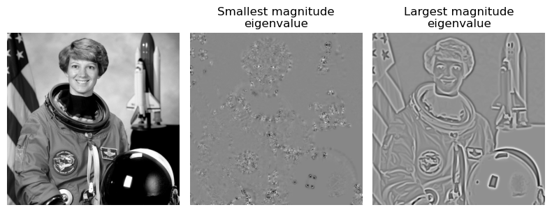

diptorch
================

<!-- WARNING: THIS FILE WAS AUTOGENERATED! DO NOT EDIT! -->

## Install

``` sh
pip install diptorch
```

## Hello, World!

``` python
import matplotlib.pyplot as plt

from diptorch.filters import gaussian_filter
from diptorch.utils import astronaut
```

``` python
# Zero-th order Gaussian filter (smoothing)
img = astronaut()
img_filtered = gaussian_filter(img, sigma=2.5)

plt.figure(figsize=(6, 3))
plt.subplot(121)
plt.imshow(img.squeeze(), cmap="gray")
plt.axis("off")
plt.subplot(122)
plt.imshow(img_filtered.squeeze(), cmap="gray")
plt.axis("off")
plt.tight_layout()
plt.show()
```


``` python
# First-order Gaussian filter
img = astronaut()
img_filtered = gaussian_filter(img, sigma=2.5, order=1)

plt.figure(figsize=(6, 3))
plt.subplot(121)
plt.imshow(img.squeeze(), cmap="gray")
plt.axis("off")
plt.subplot(122)
plt.imshow(img_filtered.squeeze(), cmap="gray")
plt.axis("off")
plt.tight_layout()
plt.show()
```


``` python
# Second-order Gaussian filter on the height dimension (y-axis)
img = astronaut()
img_filtered = gaussian_filter(img, sigma=2.5, order=[2, 0])

plt.figure(figsize=(6, 3))
plt.subplot(121)
plt.imshow(img.squeeze(), cmap="gray")
plt.axis("off")
plt.subplot(122)
plt.imshow(img_filtered.squeeze(), cmap="gray")
plt.axis("off")
plt.tight_layout()
plt.show()
```


## Hessian matrix

``` python
from diptorch.filters import hessian, hessian_eigenvalues
from einops import rearrange
```

``` python
# Hessian matrix of an image (all second-order partial derivatives)
img = astronaut()

H = hessian(img, sigma=2.5, as_matrix=True)
H = rearrange(H, "B C1 C2 H W -> B (C1 H) (C2 W)")

plt.imshow(H.squeeze(), cmap="gray")
plt.axis("off")
plt.show()
```


``` python
# Eigenvalues of the Hessian matrix of an image
img = astronaut()
eig = hessian_eigenvalues(img, sigma=2.5)

plt.figure(figsize=(9, 3))
plt.subplot(131)
plt.imshow(img.squeeze(), cmap="gray")
plt.axis("off")
plt.subplot(132)
plt.imshow(eig.squeeze()[0], cmap="gray")
plt.title("Smallest eigenvalue")
plt.axis("off")
plt.subplot(133)
plt.imshow(eig.squeeze()[1], cmap="gray")
plt.title("Largest eigenvalue")
plt.axis("off")
plt.tight_layout()
plt.show()
```


